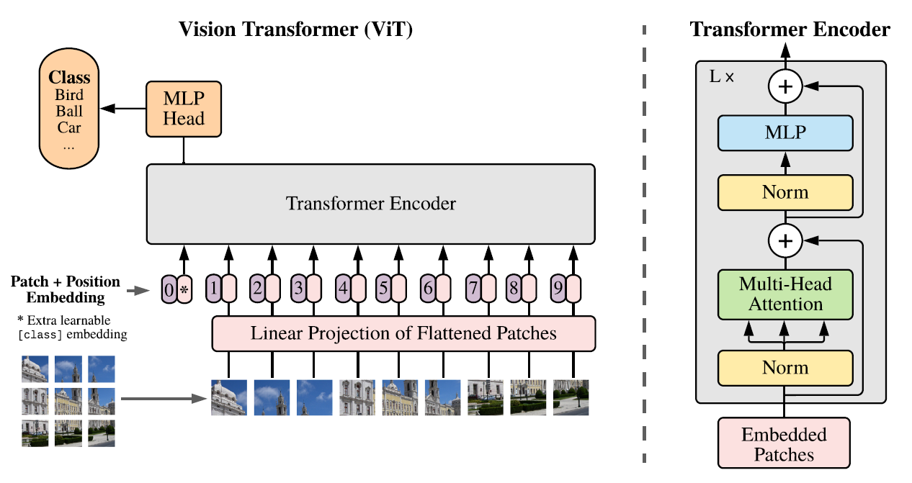
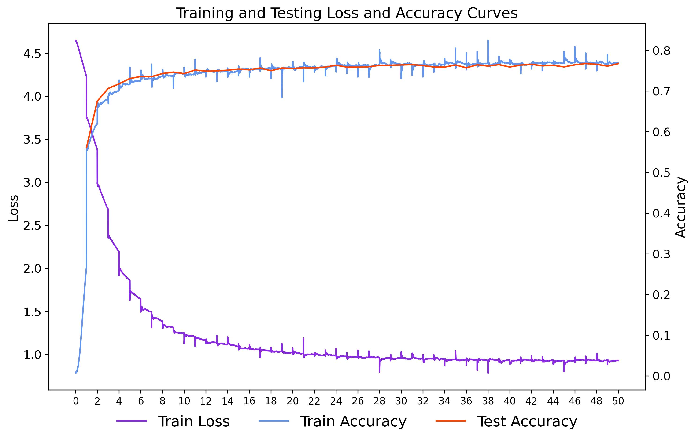
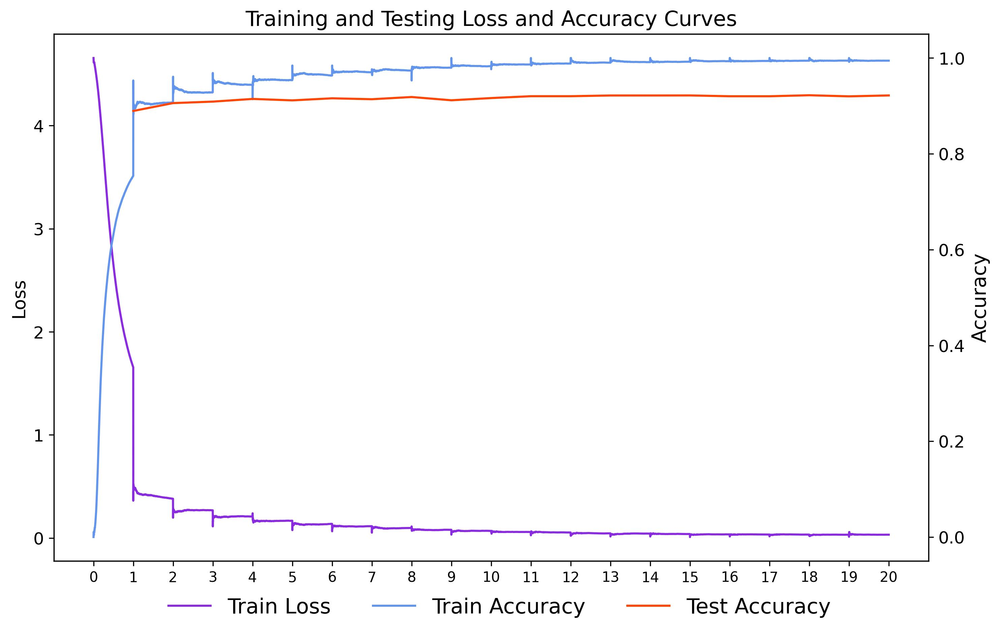
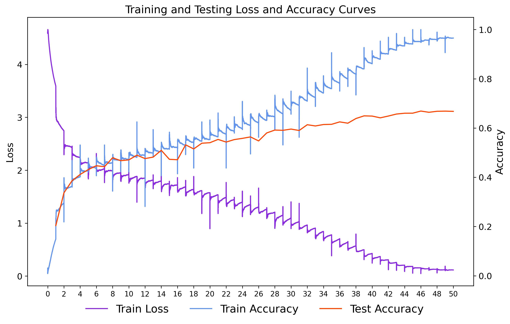

# Fine-tuning of ViT-B16 on CIFAR-100

Application of VisionTransformer(ViT-B/16) for image classification on CIFAR-10 and CIFAR-100 dataset. After using different fine-tuning methods on pre-trained model and trying to increase the performance, there are some explorations and findings about the performance of Transformer's architecture for image classification.

## Requirement

Experiment Eviroument

- python3.10.9
- pytorch2.5.1+cu121

Download repository:

```bash
$ git clone https://github.com/ZipperLii/ViT-B16-on-CIFAR100
```

## Implemented components

- **Vision Transformer architecture** implemented *from scratch* which includes Multihead Self-Attention, MLP, EncoderBlock and MLP Head(classification) module.

- **Fine-tuning model** by Feature Abstraction, Parameter Efficient Fine-Tuning(PEFT) and Full Fine-Tuning(FFT) on CIFAR-100.

- **Process Visualization** including *Attention Map*, *Positional Embedding* and *Patch Embedding filters*.

## Fine-tuning ViT-B/16 on CIFAR-100

### ViT architecture

Based on Transformer, images are divided into patches by filters and then flattend before embedding. After positional embedding, the model can recognize positional and various kinds of information between patches by multi-head self-attention mechanism.



### Dataset

[CIFAR-100](https://www.cs.toronto.edu/~kriz/cifar.html)

These two datasets contain 50000 images for training and 10000 for testing respectively.

I have tried to train ViT-B16 on CIFAR-10 from the ground up, but the performance is far away from CNNs

- 50 epochs with SGD(Momentum=0.9) → 0.6327 acc on test set
- 60 epoch with Adam(L2-Regularization) → overfitting occurring after 20 epoch

It seems  hard to train on CIFAR dataset from the ground up. The architecture of ViT is more complex than other effective CNNs. So, it is easier for ViT to be overfitted on datasets of small scale like CIFAR-10 and CIFAR-100. It verified the conclusion of [2010.119290](https://arxiv.org/pdf/2010.11929).

### Pre-trained Model

The model is pre-trained on ImageNet-21k dataset which contains bigger amounts of images with more classes. So, there are more features learnt in pre-training process. 

In this task, we deploy ViT-B/16 locally and load [pre-trained weights](https://storage.googleapis.com/vit_models/imagenet21k/ViT-B_16.npz) to address the training problem.

```python
!wget https://storage.googleapis.com/vit_models/imagenet21k/ViT-B_16.npz 
```

### Params and Configuration

- architecture configuration(Params$\approx$86M)

| Hyperparams | patch_size | hidden_size | MLP<br>dim | Head<br>num | layer_num<br>(EncoderBlk) | Attention<br>Dropout | MLP<br>Dropout |
|:-----------:|:----------:|:-----------:|:----------:|:-----------:|:-------------------------:|:--------------------:|:--------------:|
| **Value**   | 16×16      | 768         | 3072       | 12          | 12                        | 0.0                  | 0.1            |

- Change the out dimension of MLP_head to be 100 for classification

#### 1. Feature Abstraction (fine-tuning mlp_head)

- **Freezing all parameters except output layer** (MLP_head)

- 50 Epochs with 256 batch_size

- Optimizer: SGD(Momentun=0.9, weight_decay=0.0001)

- lr: 1e-2(cosine decay)

##### Result＆Analysis

- Test Accuracy = 0.7726

- According to the following plot, if we fine-tune by just unfreezing the mlp_head, the model converges with 0.7726 test accuracy.

- It shows that the pre-trained model already have the capacity of capturing quantitative features even though we just rectified the output head.



#### 2. PEFT (unfreeze mlp layers and mlp_head)

- **Freezing all parameters except mlp layers in all encoder bolck and output layer** (MLP_head)

- 20 Epoch with 64 batch_size

- Optimizer: SGD(Momentun=0.9, weight_decay=0.0001)

- lr: 1e-2(cosine decay)

##### Result＆Analysis

- Test Accuracy = 0.9248
- By fine-tuning mlp head and all mlp layers of encoder, the accuracy increased 0.1522.
- The transfer performance(top1 acc) is slightly better than the outcome of [2010.119290](https://arxiv.org/pdf/2010.11929) by SGD with 0.9 momentum and cosine decay learning rate.



#### 3. Full Fine-Tuning

- 20 Epoch with 64 batch_size

- Optimizer: SGD(Momentun=0.9, weight_decay=0.0001)

- lr: 1e-2(cosine decay)

##### Result＆Analysis

- Test Accuracy = 0.6691
- By FFT, I finally got a high training accuracy but acc=0.6691 on test set. The model overfit due to its higher complexity than CNNs on CIFAR-100.



#### Conclusion

According to the three fine-tuning experiment, it is optimal to fine-tune mlp layers and mlp head. CIFAR-100 has much less amount of images than ImageNet, which poses the overfitting of ViT. So, FFT may be not the best fine-tuning choice. Even I ever tried to freeze other layers to only adjust the attention layers of encoder blocks based on the second outcome(PEFT-ViT with acc=0.9248), it is hard to make any improvement.

There are some possibly potential improvement to further explore, such as applying different fine-tuning policy among 12 encoder layers of Transformer, adding some simple CNNs to abstract more detailed features before patch embedding and fine-tuning layer by layer....

### Visiualization

#### 1. Attention Map

By abstracting 12 attention weights of 12 Transformer block and processing them(more details in [attention_map.py](attention_map.py)), we can get the attention map.

The original images are in the upper row with groundtruth. The attention maps are in the lower row which predict how the regions weight.

The high value of greyscale(lighter) means that the model paied more attention to this region.


#### 2. Patch Embedding


According to the map of principal filters of PEFT and FFT model, the patch embedding layer of FFT model can hardly be trained due to the depth of model.

By freezeing pre-trained model's embedding layer, we can effectively make use of it to abstract and embed features.

#### 3. Patch Embedding

The Cosine Similarity Matrix of learnable Position Embeddings denotes clear locality pattern as every 14th value is highly correlated as the patch size (16) divides the image (224x224) into a 14x14 matrix.


### Download model weights

- [HEAD-PEFT-acc0.7726-Epoch50](https://connecthkuhk-my.sharepoint.com/:f:/g/personal/u3637438_connect_hku_hk/EoDb8JWfCxFOh-e9ffIE_9MB2aZUTA4t8Ml3JMNwSJe73g?e=4RKzMg)

- [MLP-PEFT-acc0.9248-Epoch20](https://connecthkuhk-my.sharepoint.com/:f:/g/personal/u3637438_connect_hku_hk/EoDb8JWfCxFOh-e9ffIE_9MB2aZUTA4t8Ml3JMNwSJe73g?e=4RKzMg)

- [FFT-acc0.6691-Epoch50](https://connecthkuhk-my.sharepoint.com/:f:/g/personal/u3637438_connect_hku_hk/EoDb8JWfCxFOh-e9ffIE_9MB2aZUTA4t8Ml3JMNwSJe73g?e=4RKzMg)

- ### Results

| dataset   | model                               | top1<br>acc | epoch<br> | batch_size | weight<br>decay |
|:---------:|:-----------------------------------:|:-----------:|:---------:|:----------:| --------------- |
| cifar-100 | ViT-B16<br>(Feature<br>Abstraction) | 0.7266      | 50        | 256        | 0.0001          |
| cifar-100 | ViT-B16<br>(PEFT)                   | 0.9248      | 20        | 64         | 0.0001          |
| cifar-100 | ViT-B16<br>(FFT)                    | 0.6691      | 50        | 32         | 0.0001          |

### Reference

1. [KingDomDom/ViT-CIFAR100-python](https://github.com/KingDomDom/ViT-CIFAR100-python)

2. [ra1ph2/Vision-Transformer](https://github.com/ra1ph2/Vision-Transformer?tab=readme-ov-file)

### Author

ZipperLi (Zhepei Li)

Thanks for your time!